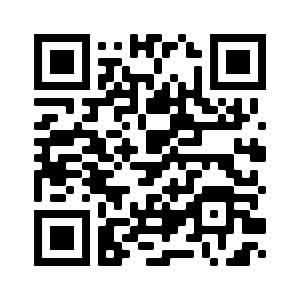

# Movie-Hype-Generator
## Description
- The drive of this project was to allow users the ability to easily access related comics to upcoming movies.
- The end results of this project show the abilities of our group to coordinated our efforts in structuring, designing and building a functional web based application that utilizes html, css, and javascript.
- Some issues that we ran into during this project were associated initially with the API's that were chosen for our databases.  After trouble shooting, intiial API choices were replaced with more viable candidates for API databases that we proceeded to use in our final application.

## Table of Contents

- [Installation](#installation) -- No install necessary
- [Usage](#usage)-Open in Browser
- [Credits](#credits)- See below.
- [License](#license) MIT License
## Installation
No install required
## Usage
Open in browser.  
## Screenshot
 

## Credits
Tina Stanczyk & Michael Hranek
## License
MIT License

Copyright (c) [2021] "Andrew J Read"

Permission is hereby granted, free of charge, to any person obtaining a copy
of this software and associated documentation files (the "Software"), to deal
in the Software without restriction, including without limitation the rights
to use, copy, modify, merge, publish, distribute, sublicense, and/or sell
copies of the Software, and to permit persons to whom the Software is
furnished to do so, subject to the following conditions:

The above copyright notice and this permission notice shall be included in all
copies or substantial portions of the Software.

THE SOFTWARE IS PROVIDED "AS IS", WITHOUT WARRANTY OF ANY KIND, EXPRESS OR
IMPLIED, INCLUDING BUT NOT LIMITED TO THE WARRANTIES OF MERCHANTABILITY,
FITNESS FOR A PARTICULAR PURPOSE AND NONINFRINGEMENT. IN NO EVENT SHALL THE
AUTHORS OR COPYRIGHT HOLDERS BE LIABLE FOR ANY CLAIM, DAMAGES OR OTHER
LIABILITY, WHETHER IN AN ACTION OF CONTRACT, TORT OR OTHERWISE, ARISING FROM,
OUT OF OR IN CONNECTION WITH THE SOFTWARE OR THE USE OR OTHER DEALINGS IN THE
SOFTWARE.
## Badges
N/A
## Features
N/A
## How to Contribute

## Tests
Tested during milestones.
